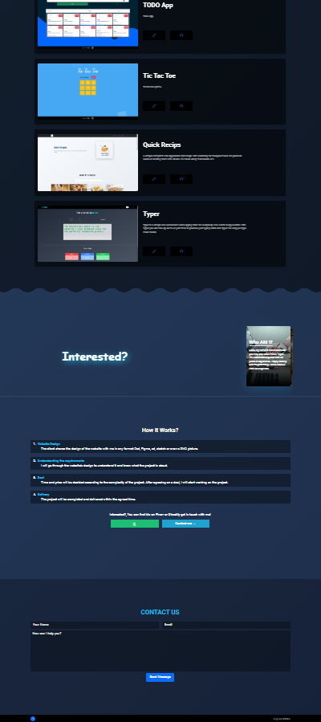

# Portfolio
Official Website [https://xvpc.dev](https://xvpc.dev/)

## Technologies
- HTML
- CSS
- JavaScript
- BootStrap
- Sass
- Material-UI
- Framer-Motion
- ReactJs
- NextJs

Check package.json.

## Screenshots

## Disclaimer
Swiper Images
[unsplash.com](https://unsplash.com/photos/5fNmWej4tAA)
[unsplash.com](https://unsplash.com/photos/Mx0yDbKMPSk)
[unsplash.com](https://unsplash.com/photos/ocAo7MwGfHY)

Cursor
[flaticon.com](https://www.flaticon.com/free-icon/cursor_4610128?related_id=4610127&origin=search)
[flaticon.com](https://www.flaticon.com/free-icon/add_982636?related_id=864380&origin=search)
