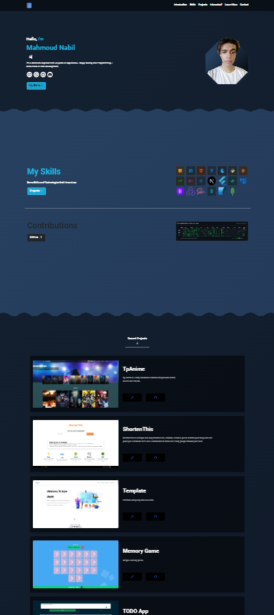

## Portfolio

[https://xvpc.dev](https://xvpc.dev)

### Technologies
- HTML
- CSS
- JavaScript/TypeScript
- BootStrap
- Scss
- Material-UI
- Framer-Motion
- ReactJs
- NextJs

Check package.json.

## Screenshots

## Disclaimer
Swiper Images:
[unsplash.com](https://unsplash.com/photos/5fNmWej4tAA)
[unsplash.com](https://unsplash.com/photos/Mx0yDbKMPSk)
[unsplash.com](https://unsplash.com/photos/ocAo7MwGfHY)

Background:
[eggradients.com](https://www.eggradients.com)

CSS Patterns:
[css-generators.com](https://css-generators.com)

Language Icons that in the skills are publicly searchable -> Check skills.json.
